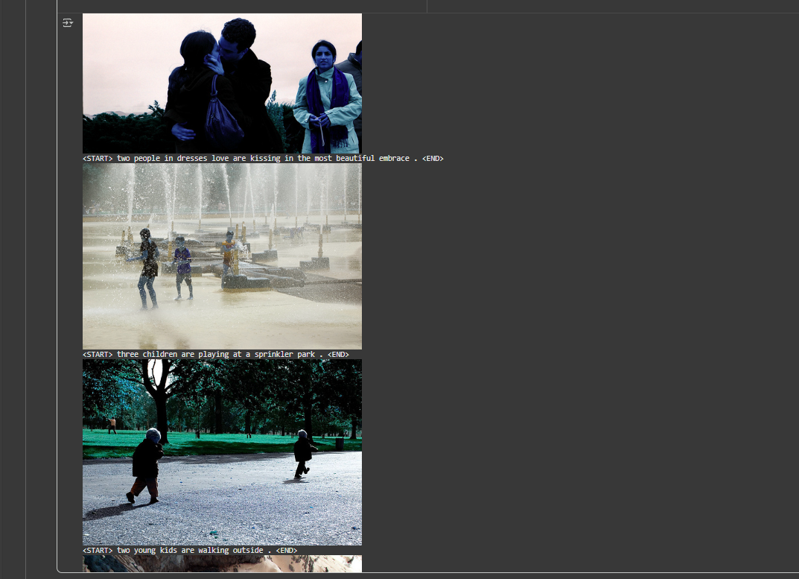
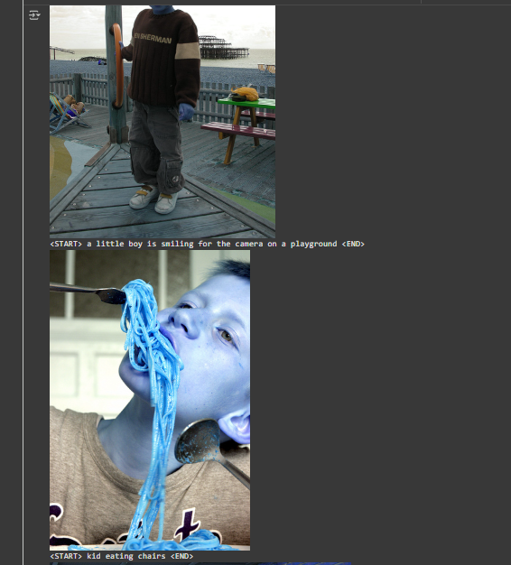

# CNN-Transformer-Image-Captioning

This project implements a multimodal deep learning model that combines computer vision and natural language generation through a CNN–Transformer pipeline.
The system learns to extract visual representations from images and map them to natural-language captions, demonstrating the core principle of cross-domain learning between vision and text.

---

## The Objective!
To train a model that can recognise visual content and describe it in plain English, transforming images into coherent textual captions.

**Example**

Input: an image of a dog running on grass  
Output: "a dog running through a field"

---

## Architecture Overview
- **Encoder:** EfficientNet-B0 (pretrained CNN) extracts visual features.  
- **Decoder:** Transformer-based language model generates textual descriptions.  
- **Tokenizer:** Basic English tokenizer from TorchText with a custom vocabulary.  
- **Dataset:** [Flickr8k](https://www.kaggle.com/datasets/adityajn105/flickr8k) - contains 8k images, each with five captions.

The encoder is frozen during training for efficiency, while the Transformer learns to map feature embeddings to grammatically consistent captions.

---

## How to Run

Because the full training notebook is large, both the **Jupyter notebook** and **pretrained weights** are provided under the repository’s [Releases](https://github.com/444yan/CNN-Transformer-Image-Captioning/releases).

To reproduce the results or run inference, download both files and use them in your own Google Colab environment.

**Files required:**
- `Image_Captioning_Model.ipynb` – the complete training and inference notebook  
- `image_caption_weights.pt` – pretrained model weights

---

### 1. Set up the environment
1. Open [Google Colab](https://colab.research.google.com).  
2. Click **File → Upload notebook** and select the downloaded `Image_Captioning_Model.ipynb` file.  
3. Ensure your runtime is set to **GPU**:


### 1. Download + Place the dataset
Download the [Flickr8k dataset](https://www.kaggle.com/datasets/adityajn105/flickr8k) from Kaggle.  
After extracting it, you should have a folder that includes:

/Images/ # Folder containing all Flickr8k images

captions.txt # Text file containing image:caption pairs

Upload this folder to your Google Drive.  

---

### 2. Download + Place pretrained weights
after pretrained weights provided in this repository’s [Releases](https://github.com/444yan/CNN-Transformer-Image-Captioning/releases).  
Save the file `image_caption_weights.pt` directly in your Google Drive root folder.


---

### 3. Mount Google Drive in Colab
Run the first setup cell in the notebook to mount your Drive and access the dataset and weights:

```python
from google.colab import drive
drive.mount('/content/drive')
%cd /content/drive/MyDrive/Flickr8kVersion
```
---

4. Run the notebook

Run all setup cells to import dependencies and initialise the model.

The notebook will automatically load your pretrained weights if found.

Execute the Inference section to generate captions for a few test images.

Optionally, run the Training section to retrain the model (approx. 1.5–2 hours on a Colab A100 GPU training over 10 epochs).

## Results

After 20 epochs of training on the Flickr8k dataset, the model generated coherent, descriptive captions that accurately alligned with the visual content of the images.  
Below are representative outputs from the trained model:


  
  


*(Images are taken from the Flickr8k dataset and used for educational purposes.)*

These results demonstrate that the CNN–Transformer model successfully learns multimodal relationships between visual features and linguistic tokens.  
While some outputs remain syntactically imperfect, the captions show a clear understanding of object context and activity.

---

## Future Work

The project can be extended and refined in several directions:

## Future Work

The project can be extended and refined in several directions:

- **Increase context window:** Extend the maximum caption length beyond 10 tokens to allow more detailed and context-rich descriptions.  
- **Larger training data:** Use datasets such as **MS-COCO** to improve generalisation and vocabulary coverage.  
- **Fine-tuning the encoder:** Unfreeze the CNN layers to enable joint optimisation and richer visual representations.  
- **Experiment with decoding strategies:** Implement strats such as **beam search** or **top-k sampling** to perhaps output more fluent and coherent captions.  
- **Evaluation metrics:** Introduce **BLEU**, **ROUGE**, and **CIDEr** scores for quantitative assessment of caption quality.  
- **User interface:** Develop a simple web interface using tech such as **Flask**  for real-time caption generation.


---
